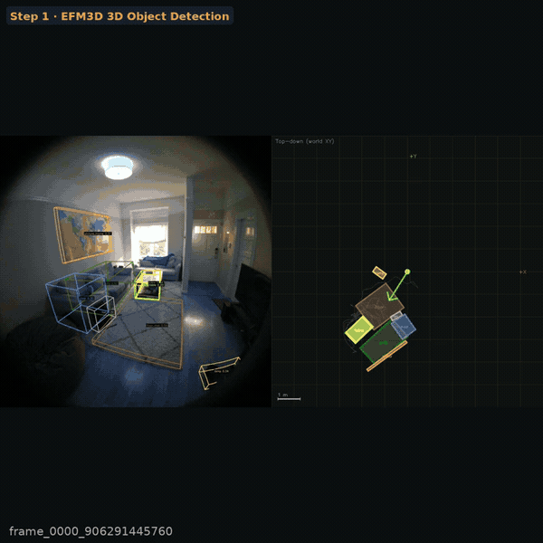

# SpatialCortex

**Spatial memory system for AR/VR — walk into a room, remember it forever, query it in natural language.**

> Built on 3D Gaussian Splatting · EFM3D · CLIP ViT-L/14 · LLaVA 1.5 7B · Three.js · Rerun.io



---

## What is this?

SpatialCortex gives AR/VR devices (or robots) persistent spatial memory. On first entry, it maps an environment and detects every object in 3D. Later, you can ask *"Where did I leave the hammer?"* in natural language and get an AR navigation path back to it — even after leaving and returning.

**Four-stage pipeline:**

```
[Entry]  VRS recording  →  COLMAP SfM → SLAM trajectory + 3D Gaussian Splatting
                        →  Grounded-SAM 2: open-vocab 2D detection + SAM 2 masks
                        →  Depth Anything V2 (metric, COLMAP-calibrated) → dense depth
                        →  Depth unproject → 3D AABBs → visualized as projected cuboids
                        →  Scene graph: 3D bboxes + CLIP ViT-L/14 embeddings → FAISS

[Query]  "Where is the toaster?"
                        →  CLIP retrieval → Gemma 3 27B visual confirmation
                        →  Re-localization in stored map
                        →  Dijkstra navigation path → AR overlay
```

---

## Architecture

```
┌─────────────────────────────────────────────────────────────────┐
│  Input: Project Aria .vrs recording                             │
└───────────────────────┬─────────────────────────────────────────┘
                        │
          ┌─────────────▼─────────────┐
          │   SLAM + 3D Gaussian      │  projectaria_tools (VIO poses)
          │   Splatting               │  gaussian-splatting (3DGS)
          └─────────────┬─────────────┘
                        │
          ┌─────────────▼─────────────┐
          │   Open-Vocab 3D Detection │  Grounded-SAM 2 (2D masks)
          │                           │  Depth unprojection → 3D bbox
          └─────────────┬─────────────┘
                        │
          ┌─────────────▼─────────────┐
          │   Spatial Memory DB       │  SQLite (objects + poses)
          │                           │  FAISS (CLIP ViT-L/14 vectors)
          └──────┬──────────┬─────────┘
                 │          │
    ┌────────────▼──┐  ┌────▼────────────────┐
    │  VLM Query    │  │  Navigation          │
    │  Gemma 3 27B  │  │  Dijkstra on         │
    │  (on-device)  │  │  waypoint graph      │
    └────────────┬──┘  └────┬────────────────┘
                 │          │
          ┌──────▼──────────▼──────────┐
          │   Visualization             │
          │   Three.js (web map)        │
          │   Rerun.io (real-time)      │
          └─────────────────────────────┘
```

---

## Tech Stack

| Component | Technology |
|---|---|
| Scene reconstruction | 3D Gaussian Splatting (Kerbl et al., ICCV 2023) |
| 2D detection + segmentation | Grounded-SAM 2 = Grounding DINO + SAM 2 (Meta AI / IDEA Research, 2024) |
| Depth estimation | Depth Anything V2 metric-indoor (COLMAP scale-calibrated) |
| 3D lifting | Depth unprojection → axis-aligned 3D bboxes, visualized as projected cuboids |
| Semantic embeddings | CLIP ViT-L/14 + FAISS |
| Spatial VLM | LLaVA 1.5 7B (on-device, HF cache, no token required) |
| Spatial database | SQLite + FAISS index |
| Visualization | Three.js (interactive web map) + Rerun.io (real-time dashboard) |
| Navigation | Dijkstra on SLAM waypoint graph |
| Input data | Project Aria Gen 2 `.vrs` recordings |
| *(Stretch)* Language 3D field | LangSplat / LangSplatV2 — CLIP features embedded in 3D Gaussians |

---

## Current Status

| Milestone | Status |
|---|---|
| Aria VRS → JSON converter (`vrs_to_json.py`) | ✅ Done |
| Rerun.io VRS viewer (`visualize_vrs.py`) | ✅ Done |
| Three.js interactive map — bounding boxes, nav path, query sidebar | ✅ Done |
| COLMAP SfM — undistorted frames + camera poses | ✅ Done |
| **EFM3D inference on AEO seq00/01/02** | ✅ Done |
| **Per-snippet OBB visualization (fisheye + top-down, `visualize_efm3d_obbs.py`)** | ✅ Done |
| **Scene-level OBB fusion (`fuse_scene_obbs.py`)** | ✅ Done |
| **Scene top-down map (`scene_topdown.py`)** | ✅ Done |
| **Best-view crop extraction per object (`extract_crops.py`)** | ✅ Done |
| **CLIP ViT-L/14 embedding + FAISS index (`build_scene_db.py`)** | ✅ Done |
| **Natural language query CLI (`query_scene.py`)** | ✅ Done |
| **3D Gaussian Splatting reconstruction** | ✅ Done (30k iter, 210 MB `.ply` + flythrough) |
| **Visual query — full frame + 3D boxes + LLaVA (`query_visual.py`)** | ✅ Done |
| **CLIP keyframe index for re-localization (`build_keyframe_index.py`)** | ✅ Done |
| **Re-localization + Dijkstra navigation + HUD arrow (`navigate.py`)** | ✅ Done |
| **Full-sequence navigation video renderer (`render_nav_video.py`)** | ✅ Done |
| Grounded-SAM 2 on registered frames (`run_gsam2.py`) | 🔲 Planned |
| Depth Anything V2 + COLMAP scale calibration (`estimate_depth.py`) | 🔲 Planned |
| End-to-end demo video | 🔲 Planned |

---

## How to Run

### 1. Clone & setup environment

```bash
git clone https://github.com/KiwooShin/SpatialCortex.git
cd SpatialCortex

# Create conda environment with projectaria-tools + rerun
conda create -n aria python=3.10 -y
conda activate aria
pip install projectaria-tools rerun-sdk
```

### 2. Extract SLAM data from a VRS recording

Converts VIO trajectory and synthesizes a point cloud from a raw Project Aria `.vrs` file into the JSON format consumed by the web viewer.

```bash
conda activate aria
python3 scripts/ingest/vrs_to_json.py \
  --vrs /path/to/recording.vrs \
  --output data/aria_vrs.json \
  --points 15000          # number of synthetic environment points
  --subsample 1           # take every Nth VIO pose (1 = all)
```

### 3. Extract RGB video for live camera feed sync

Exports all RGB frames as a compressed MP4. The web viewer syncs this video with the 3D trajectory playback.

```bash
conda activate aria
python3 scripts/ingest/extract_video.py \
  --vrs /path/to/recording.vrs \
  --output data/rgb_video.mp4\
  --width 640 \
  --fps 10
```

### 4. Run COLMAP SfM (already done on this dataset)

Extracts undistorted RGB frames and runs COLMAP to produce camera poses and a sparse point cloud.

```bash
conda activate aria
python scripts/reconstruct/run_colmap.py \
  --vrs /path/to/recording.vrs \
  --output data/colmap \
  --every-nth 2
# Output: data/colmap/images/ + data/colmap/sparse/0/
```

### 5. Run the 3D detection pipeline

Single script: runs Grounded-SAM 2, Depth Anything V2, and 3D lifting in one pass.
Each frame is fully processed before moving to the next — no intermediate files required.

```bash
conda activate gsam2
python scripts/reconstruct/detect_objects_3d.py \
  --colmap  data/colmap \
  --output  data/detections_3d.json \
  --vis-dir data/visualizations
# Output:
#   data/detections_3d.json      ← [{object_id, label, bbox_3d, …}]
#   data/visualizations/*.jpg    ← frames annotated with projected 3D cuboids
```

Each visualization frame shows per-class coloured 3D cuboids projected onto the original image, with light transparent fills and text labels (`label confidence`).

To also save intermediate masks and depth maps for debugging:
```bash
python scripts/reconstruct/detect_objects_3d.py \
  --colmap      data/colmap \
  --output      data/detections_3d.json \
  --vis-dir     data/visualizations \
  --save-masks  data/debug/masks \
  --save-depth  data/debug/depth
```

### 6. Build the spatial memory database (CLIP + FAISS)

Extracts a best-view RGB crop per detected object, encodes each with CLIP ViT-L/14, and stores everything in SQLite + a FAISS flat cosine index. All model weights are cached locally after the first run — no network calls during inference.

```bash
# Step A — extract best-view crops from VRS for each fused object
conda activate efm3d
python scripts/detect/extract_crops.py \
  --scene-obbs   output/efm3d_aeo_seq01/.../scene_obbs.csv \
  --snippet-obbs output/efm3d_aeo_seq01/.../snippet_obbs.csv \
  --vrs          data/aeo/aeo_seq01_.../main.vrs \
  --traj         data/aeo/aeo_seq01_.../mps/slam/closed_loop_trajectory.csv \
  --output-dir   output/crops/seq01 \
  --scene-name   seq01

# Step B — encode all crops and build the DB (run once for all scenes)
python scripts/detect/build_scene_db.py \
  --crops output/efm3d_aeo_seq00/.../scene_obbs_crops.csv \
          output/efm3d_aeo_seq01/.../scene_obbs_crops.csv \
          output/efm3d_aeo_seq02/.../scene_obbs_crops.csv \
  --db    data/scene_db.sqlite \
  --faiss data/scene.faiss
```

### 7. Query the spatial memory

```bash
# Single query (CLIP retrieval only, fully local)
python scripts/query/query_scene.py --query "where is the sofa"

# Filter to one scene
python scripts/query/query_scene.py --query "find me a lamp" --scene seq02

# Interactive query loop
python scripts/query/query_scene.py --interactive

# With LLaVA 1.5 7B visual confirmation (requires model download first)
python scripts/query/query_scene.py --download-vlm   # one-time download (~13 GB)
python scripts/query/query_scene.py --query "where is the bed" --vlm
```

### 8. Visual query — full frame + 3D bounding boxes + LLaVA

Ask a question; get back the actual video frame where the object was best seen, with 3D bounding boxes projected onto it and a natural language description from LLaVA.

```bash
conda activate efm3d

# Single query — saves annotated frame to output/query_result.jpg
python scripts/query/query_visual.py --query "where is the sofa" --vlm

# Custom output path
python scripts/query/query_visual.py --query "where is the bed" --out output/query_bed.jpg --vlm

# Filter to one scene
python scripts/query/query_visual.py --query "find me a lamp" --scene seq02 --vlm

# Interactive loop (saves query_result_000.jpg, _001.jpg, …)
python scripts/query/query_visual.py --interactive --vlm

# Without VLM — programmatic answer only, much faster
python scripts/query/query_visual.py --query "where is the chair"
```

**Example output:**
```
── Answer ─────────────────────────────────────────────────────
  Object   : BED
  Scene    : seq02
  Frame ts : 245288370176  (245.288 s into recording)
  Position : (-1.48, -1.09, -1.07) m
  Nearby   : container, table, window, lamp, chair
  Image    : output/query_bed.jpg

  LLaVA: "The bed is in the center of the room, surrounded by a container,
           table, window, lamp, and chair."
```

The annotated frame shows:
- **White box** with `>>> OBJECT <<<` label + arrow → the queried object (fused scene position)
- **Coloured boxes** (class colours) → context objects detected in the same snippet
- **Banner** at top → scene name, timestamp, query target

**Example output:**
```
Searching: "where is the sofa"

  [1] SOFA
      Scene     : seq01
      Position  : (-1.45, -1.90, -1.09) m  (world XYZ)
      Size      : 1.52×1.45×0.84 m
      Confidence: 0.99  (50 observations fused)
      Similarity: 0.217
      Nearby    : cart, window, lamp, chair
      Crop      : output/crops/seq01/004_sofa.jpg
```

**Retrieval design:**
- CLIP ViT-L/14-quickgelu (OpenAI weights, fully local via HF cache)
- Two-bucket ranking: objects whose class name appears in the query are surfaced first; CLIP cosine similarity breaks ties within each bucket
- Synonym expansion: "sit" → chair/sofa, "sleep" → bed/sofa, "light" → lamp, etc.
- Objects without a valid crop are stored in SQLite only (not in FAISS) to prevent text-embedding artifacts from polluting cosine search

---

### 9. Re-localization + navigation

Given a photo from your current location, re-localize within the stored map and compute a navigation path to any queried object.

```bash
conda activate efm3d

# Build the keyframe CLIP index first (one-time, ~30 s)
python scripts/detect/build_keyframe_index.py
# Output: data/keyframe_index.faiss + data/keyframe_index.csv (303 keyframes)

# Re-localize from an image and navigate to an object
python scripts/navigate/navigate.py \
    --image /path/to/query_frame.jpg \
    --find  "lamp" \
    --out   output/nav_result.jpg

# Specify scene explicitly (skips re-localization)
python scripts/navigate/navigate.py --scene seq01 --find "sofa" --out output/nav_sofa.jpg
```

Output: fisheye frame with 3D OBBs overlaid, navigation waypoints projected on the floor, and a HUD compass arrow in the bottom-right corner showing real-time direction and distance to the target.

**Re-localization** uses CLIP ViT-L/14 image embeddings matched against the 303-keyframe FAISS index (cosine similarity). **Navigation** samples waypoints every 0.5 m along the SLAM trajectory and runs Dijkstra with a kNN-5 graph.

### 10. Navigation video — full sequence with AR overlay

Render every RGB frame of a recording with live 3D OBB overlays and a HUD compass arrow pointing toward the queried target object throughout the entire walk.

```bash
conda activate efm3d

# Full sequence (998 frames @ 10 fps → ~100 s video)
python scripts/navigate/render_nav_video.py \
    --scene seq01 \
    --find  "lamp" \
    --out   output/nav_video_seq01_lamp.mp4

# Quick preview (every 3rd frame)
python scripts/navigate/render_nav_video.py \
    --scene seq01 --find "sofa" \
    --stride 3 --out output/nav_preview.mp4
```

Each frame shows:
- **Coloured 3D OBBs** (per-frame, from `snippet_obbs.csv`) projected onto the fisheye image — correctly oriented for that exact frame
- **White highlighted box** `>>> TARGET <<<` for the queried object
- **HUD compass** (bottom-right): arrow pointing toward the target + live distance readout
- **Banner** (top): `Scene | Target | Dist: X.X m | Frame N/total`

> **Implementation note**: uses `snippet_obbs.csv` (per-frame detections) rather than `scene_obbs.csv` (fused). The fused file naively averages quaternions from observations that oscillate between two 90°-ambiguous orientations, producing a spurious mid-way orientation. Per-frame OBBs carry the correct orientation for each frame and project accurately.

### 11. Launch the Three.js web viewer

Interactive 3D map with sidebar query panel, object bounding boxes, and navigation path.

```bash
python3 -m http.server 8000
# Open http://localhost:8000
```

### 12. Launch the Rerun.io real-time dashboard

Streams RGB camera, SLAM cameras, VIO trajectory, and device pose into a Rerun timeline. Saves a `.rrd` replay file for offline demo.

```bash
conda activate aria

# Live interactive viewer
python3 scripts/viz/visualize_vrs.py \
  --vrs /path/to/recording.vrs

# Save .rrd for offline replay
python3 scripts/viz/visualize_vrs.py \
  --vrs /path/to/recording.vrs \
  --rrd data/session.rrd \
  --downsample 4 \
  --jpeg-quality 75

# Replay saved session
rerun data/session.rrd
```

---

## Viewer Controls

### Three.js web viewer

| Input | Action |
|---|---|
| Left drag | Orbit |
| Right drag | Pan |
| Scroll | Zoom |
| `Space` | Play / pause trajectory |
| `←` `→` | Step frames |
| `P` | Toggle point cloud |
| `T` | Toggle trajectory |
| `B` | Toggle bounding boxes |
| `N` | Toggle navigation path |
| `F` | Toggle camera frustum |
| `C` | Cycle color mode (height / confidence / uniform) |

Click an object in the sidebar → camera focuses on it, draws navigation path from current position.

---

## EFM3D 3D Object Detection

SpatialCortex integrates [EFM3D](https://github.com/facebookresearch/efm3d) (Meta Reality Labs) as the primary 3D object detection backbone. It runs directly on Project Aria `.vrs` recordings using gravity-aligned voxel lifting of DINOv2 features.

### Quick start — EFM3D inference

```bash
conda activate efm3d
cd ~/efm3d

# Run inference on an AEO sequence (one snippet every 2 s = full coverage)
python infer.py \
  --input /path/to/aeo_seq/main.vrs \
  --output-dir ~/SpatialCortex/output/efm3d_seq \
  --snip_stride 2.0 \
  --obb_only

# Fuse per-snippet OBBs into one consistent scene map (no pytorch3d required)
cd ~/SpatialCortex
conda run -n efm3d python scripts/detect/fuse_scene_obbs.py \
  --obbs  output/efm3d_seq/.../snippet_obbs.csv \
  --prob-thresh 0.20 --dist-thresh 0.80 --min-obs 2

# Render top-down scene map
conda run -n efm3d python scripts/viz/scene_topdown.py \
  --obbs  output/efm3d_seq/.../scene_obbs.csv \
  --traj  data/aeo/.../mps/slam/closed_loop_trajectory.csv \
  --output output/scene_topdown/seq_topdown.jpg \
  --title "My Scene"

# Per-frame fisheye + top-down visualization
conda run -n efm3d python scripts/viz/visualize_efm3d_obbs.py \
  --obbs  output/efm3d_seq/.../snippet_obbs.csv \
  --vrs   data/aeo/.../main.vrs \
  --traj  data/aeo/.../mps/slam/closed_loop_trajectory.csv \
  --output-dir output/efm3d_viz/
```

**Key implementation notes:**
- Aria RGB sensor image is 90° CCW from upright — the visualizer applies a CW 90° rotation to both the image array and all projected pixel coordinates.
- `scale_x/y/z` in `snippet_obbs.csv` are **full** dimensions; half-extents = scale/2.
- EFM3D's built-in `track_obbs()` requires pytorch3d (unavailable on aarch64/CUDA 13). `fuse_scene_obbs.py` is a drop-in replacement: greedy proximity clustering + confidence-weighted position/log-scale averaging + Markley quaternion mean + accumulated evidence confidence.

---

## Project Structure

```
SpatialCortex/
├── index.html                              # Three.js interactive viewer
├── plan.md                                 # Build plan
├── research.md                             # Related research reference
├── spatialcortex/                          # Shared library (imported by all scripts)
│   ├── config.py                           #   Paths, SCENES dict, CLIP/FAISS constants
│   ├── geometry.py                         #   OBB math, trajectory loading, fisheye projection
│   └── drawing.py                          #   OpenCV OBB overlay, HUD compass, class colors
└── scripts/
    ├── ingest/
    │   ├── vrs_to_json.py                  # Aria .vrs → viewer JSON
    │   ├── extract_video.py                # RGB frames → MP4
    │   └── extract_keyframes.py            # Extract N evenly-spaced keyframes
    ├── reconstruct/
    │   ├── run_colmap.py                   # VRS → undistorted frames + COLMAP SfM
    │   ├── run_gsam2.py                    # Grounded-SAM 2 open-vocab 2D detection
    │   ├── estimate_depth.py               # Depth Anything V2 metric depth
    │   ├── lift_to_3d.py                   # Depth unproject → 3D AABBs
    │   └── detect_objects_3d.py            # Full SAM2 + depth + 3D cuboid pipeline
    ├── detect/
    │   ├── fuse_scene_obbs.py              # Fuse per-snippet EFM3D OBBs → scene_obbs.csv
    │   ├── extract_crops.py                # Best-view RGB crop per fused object
    │   ├── build_scene_db.py               # CLIP embed crops → SQLite + FAISS
    │   └── build_keyframe_index.py         # CLIP image index of all VRS keyframes
    ├── query/
    │   ├── query_scene.py                  # NL query → 3D location (text output)
    │   └── query_visual.py                 # NL query → annotated VRS frame + LLaVA
    ├── navigate/
    │   ├── navigate.py                     # Re-localize → Dijkstra path → HUD arrow image
    │   └── render_nav_video.py             # Full-sequence video with live OBBs + HUD arrow
    └── viz/
        ├── visualize_vrs.py                # Rerun.io VRS real-time dashboard
        ├── visualize_colmap_points.py      # Overlay COLMAP sparse points on frames
        ├── visualize_efm3d_obbs.py         # EFM3D: fisheye + top-down per-frame viz
        └── scene_topdown.py                # EFM3D: render single scene top-down map
```

---

## References

- [3D Gaussian Splatting](https://repo-sam.inria.fr/fungraph/3d-gaussian-splatting/) — Kerbl et al., ICCV 2023
- [EFM3D / EVL](https://github.com/facebookresearch/efm3d) — Meta Reality Labs, 2024; egocentric voxel lifting for 3D OBB detection
- [DUSt3R](https://arxiv.org/abs/2312.14132) — CVPR 2024; feed-forward multi-view 3D reconstruction without calibration
- [MASt3R](https://arxiv.org/abs/2406.09756) — NAVER Labs, 2024; DUSt3R + dense matching head
- [OpenMask3D](https://openmask3d.github.io/) — NeurIPS 2023; open-vocabulary 3D instance segmentation
- [ConceptFusion](https://concept-fusion.github.io/) — RSS 2023; open-set multimodal 3D mapping via CLIP
- [OpenScene](https://pengsongyou.github.io/openscene) — CVPR 2023; CLIP feature distillation into 3D point clouds
- [LangSplat](https://langsplat.github.io/) — CVPR 2024; language-embedded 3D Gaussians (stretch goal)
- [Grounded-SAM 2](https://github.com/IDEA-Research/Grounded-SAM-2) — IDEA Research / Meta AI, 2024
- [Depth Anything V2](https://depth-anything-v2.github.io/) — metric monocular depth estimation
- [Project Aria Tools](https://github.com/facebookresearch/projectaria_tools) — Meta Reality Labs
- [Gemma 3](https://ai.google.dev/gemma) — Google DeepMind
- [Rerun.io](https://rerun.io) — multimodal data visualization

See [research.md](research.md) for detailed summaries of all related works.

---

## License

MIT
